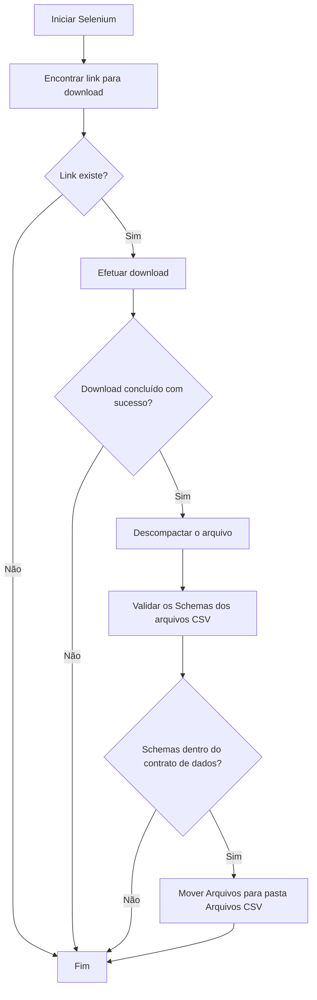

# Documentação do projeto
## Fonte de dados : Susep(Ses)  

Sistema de extração e validação dos arquivos fornecidos pela Susep.

- Efuetua webscraping na página da susep com o objetivo de efetuar o download da base estatística mensal
- Valida o Schema dos arquivos que serão utilizados no DataViz
- Gravação de logs com a biblioteca Loguru  

## Ferramentas utilizadas

## Comandos / Instruções 

Efetua a instalação das bibliotecas necessárias  
<pre><code>poetry install --no-root </code></pre>

`PATH_BASE no arquivo src.main.py` - Informa onde os arquivos serão salvos

## Fluxo de trabalho da automação

